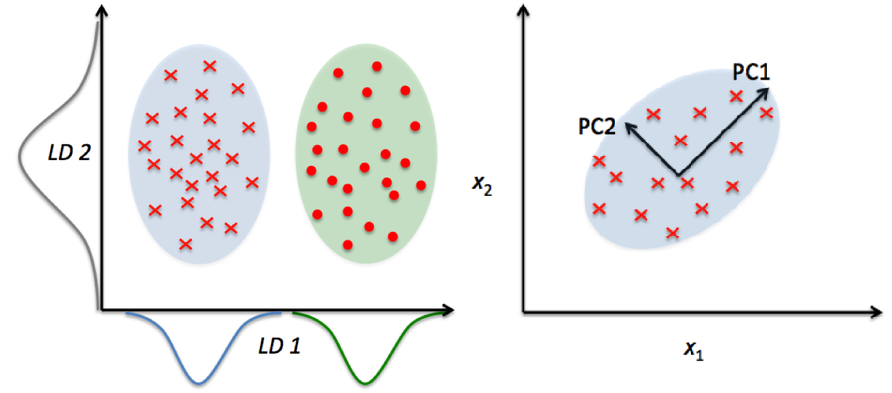

# Dimensionality Reduction

The number of input variables or features for a dataset is referred to as its dimensionality.

Dimensionality reduction refers to techniques that reduce the number of input variables in a dataset.

More input features often make a predictive modeling task more challenging to model, more generally referred to as the curse of dimensionality.

High-dimensionality statistics and dimensionality reduction techniques are often used for data visualization. Nevertheless these techniques can be used in applied machine learning to simplify a classification or regression dataset in order to better fit a predictive model

I will discover a gentle introduction to dimensionality reduction for machine learning

### After reading this, you will know:

<li>Large numbers of input features can cause poor performance for machine learning algorithms.</li>
<li>Dimensionality reduction is a general field of study concerned with reducing the number of input features.</li>
<li>Dimensionality reduction methods include feature selection, linear algebra methods, projection methods, and autoencoders.</li>

## Problem With Many Input Variables

The performance of machine learning algorithms can degrade with too many input variables.

If your data is represented using rows and columns, such as in a spreadsheet, then the input variables are the columns that are fed as input to a model to predict the target variable. Input variables are also called features.

We can consider the columns of data representing dimensions on an n-dimensional feature space and the rows of data as points in that space. This is a useful geometric interpretation of a dataset.

Having a large number of dimensions in the feature space can mean that the volume of that space is very large, and in turn, the points that we have in that space (rows of data) often represent a small and non-representative sample.

This can dramatically impact the performance of machine learning algorithms fit on data with many input features, generally referred to as the “curse of dimensionality.”

Therefore, it is often desirable to reduce the number of input features.

This reduces the number of dimensions of the feature space, hence the name “dimensionality reduction.”
